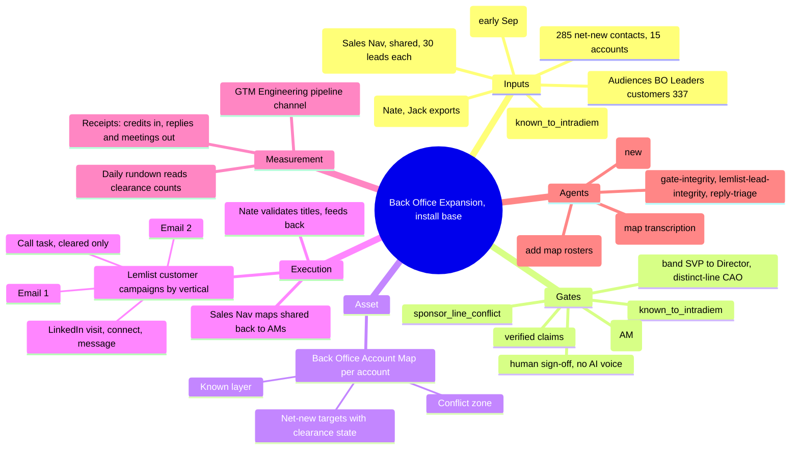

# Back Office Expansion inside the install base: strategy and plan of action

Source: Aug 24 2026 council call (Mary Ann, Naveen, Ellen, Savannah, Nate, Carter, an AM, Dallas). Otter: https://otter.ai/u/xtgffRJp6IXdeO3vi19qY5sfwdA
Written Aug 24 for Dallas. Internal working doc. The Naveen-facing project plan is derived from section 6.

## 1. What the call actually decided

- Goal (Mary Ann): open back-office conversations for Back Office Optimizer inside existing customers where the front-office sponsor will not or cannot introduce us. Pipeline for next year, not a beta head-count.
- Rule 1 (Mary Ann): never touch anyone who reports into the same leader as our current sponsor. Cigna example: Jean Marie and everyone under the same leadership are off limits. Targets sit in back-office functions (shared services, claims, fraud, payment ops, administration) between SVP and Director. A top officer who does NOT own our current line (a Chief Administrative Officer, when our people report to the COO) is fair game: "start high and get pushed down."
- Rule 2 (Mary Ann): before Nate calls behind an email, the account manager clears the name. Email is one thing, a call behind it is another.
- Rule 3 (Mary Ann): do not say "you're an existing customer." Most customers rebrand us; only their contact center knows the name. Frame as the enterprise layer their front office already runs on, only when the AM says the name is safe to use.
- Sequencing (Nate): email first, then LinkedIn, so the face is familiar before the call. About six contacts per account. A separate customer sequence, side by side with new logo.
- Input (Mary Ann, AM team): every customer account has a Sales Navigator hierarchy. AMs share their Relationship Maps with Dallas; Dallas builds the back-office maps on top of them. The AM on the call also offered key-contact lists per account.
- Marketing (Ellen): needs a project plan first (elements, cadence, content, what 6sense does). Messaging is vertical-specific (healthcare, insurance, financial services, utilities, BPO). Marketing is in Boston this week, Genesys next week, all-hands the week after. Vertical email and LinkedIn examples land early September.
- Tracking (Naveen): a new pipeline channel, "GTM Engineering," so opportunities from this motion are counted separately. He takes that to the pipeline council.
- Target (Naveen, Dallas agreed): multi-channel sequences live on the ~300 contacts by all-hands, three weeks out (week of Sep 14).
- Cadence: Tue Aug 25 Naveen + Nate + Dallas start the project plan. Group reconvenes early to mid week of Sep 7, after the maps have arrived.

## 1b. Naveen's ask, Slack DM Aug 24 (2:07-2:23 pm CDT)

- He read the four lists ("killer list"): list 1 reads as product owners, lists 2 to 4 as shared services, "on the nail." List 3 he read as VPs, list 4 as IT.
- He wants marketing to give us BOTH role-specific and industry-specific messaging options, unless we'd rather write them ourselves. Dallas: co-create is best case; examples that marketing knows work would be even better.
- "Super important to be scientific about this."
- Account-specific messaging strategy: the account managers sign off that "this type of messaging will / will not work" for their account.
- The ask verbatim: "If you can think of an 'operational process' to get this type of alignment that would be great." Dallas: "like an order of operations type of plan that is replicable." Naveen: "How this works: marketing giving us industry specific messaging options and us aligning with Account managers before we trigger a sequence. So this becomes like a proper seamless operation for future outbound efforts too."
- Dallas committed: "I'll work on that and have something ready to review with you tomorrow."

Deliverable for Tue Aug 25: `BackOffice_Outbound_Operating_Process_Aug25.html` (this folder), the seven-step order of operations with the AM sign-off sheet as the alignment mechanism, the role x vertical messaging matrix as the marketing ask, and six decisions for Naveen. Published as an artifact for the review.

## 2. Where we already stand (nothing here is hypothetical)

- 285 net-new back-office contacts across 15 customer accounts (four Jul 26 lists: Operations Leaders 97, COO/SVP 88, Product Owners 51, Claims IT 49). 227 have a validated work email, 58 are blank. Already diffed clean against Savannah's 214-row seed.
- Accounts covered: Goldman 26, JPMorgan 26, US Bancorp 24, Wells Fargo 24, Prudential 22, Elevance 21, Synchrony 20, MetLife 19, Humana 18, Foundever 16, Aetna 15, Cigna 14, Molina 14, UnitedHealthcare 14, Capita 12.
- Clay Audiences (Salesforce-synced, 0 credits to query): `BO Leaders (customers, Dir+)` 337 people (audseg_0tk324gWiTQKCqVz4tx), `BO Insurance Titles - Customers` 15 (audseg_0tk8rc0Kc2YeAJXC7uq), companies carry Account Type, Ownership and SF Owner ID, so account-to-AM mapping is already in the data.
- Install-base table t_0ti4jj1hfZyEWcfirfU (101 accounts) already has an `owner_cleared` column, every row `pending_owner`. That column is the clearance state; it was built for exactly this.
- Back Office Motion table BUILT with the inverted gate (install-base allowed, everyone else blocked). fn_persona_key returns bo_claims / bo_shared / coo_finance.
- Launch kit `launches/back-office-optimizer_2026-09/03_Sequence_Set_Skeleton.md` fixes three copy lanes (bo_claims, bo_shared, coo_finance) and the five-touch spine. Copy is not yet compiled.
- Messaging study intake (`motions/messaging-study/`) is ready, waiting on Nate's and Jack's exports.
- Agents that already do part of this: `salesnav-csv-intake` (reconciles a hand-pulled SalesNav CSV into a roster, enforces Director+), `alumni-champion-watch` (reads SalesNav alert emails), `gate-integrity-auditor`, `lemlist-lead-integrity`, `reply-triage`, `icp-committee-page-builder` (the page pattern the account maps should reuse), `pipeline-receipts-tracker`.
- Lemlist: no mailboxes provisioned yet, API returns 402 on the current tier. Contracting closes this week.

## 3. Sales Navigator, verified constraints (checked Aug 24)

- Relationship Maps share to teammates on the same contract, no limit on how many people. Shared maps are live and co-editable, with notes.
- 30 leads per map, up to 10 maps per account. No native export of a map (no CSV, no PDF). April 2026 update: a map can hold leads from several companies.
- No API, and ToS bars automation. Machine-readable surfaces stay the same three: alert emails in Outlook, hand exports, and Clay's own Sales Navigator source (a Sales Nav search URL into a Clay Find People table, 1 credit per result, up to 2,500 per source).

Consequence: the AMs' maps arrive as shared maps Dallas opens by hand. Getting them into the roster is a transcription step, not an export. Keep it small: one screenshot per map into the intake folder, the intake agent reads it and writes the CSV rows.

## 3b. Clay to Sales Nav, who does what (Dallas: the org-chart mapping is the most important step after the Clay lists)

Claude owns everything on both sides of the Sales Nav wall; Dallas's hands cross it.

Claude, fully:
- Per-account roster from Clay with LinkedIn URL, title, function, inferred level (C / EVP / SVP / VP / Director) and an inferred reports-to line, labeled as inferred until the AM's map confirms it.
- The **map build sheet** per account: the exact 30 names to add to a Sales Nav Relationship Map, ordered by level and function, with LinkedIn URLs, so adding a map takes about ten minutes of clicking.
- Transcription of the AM's shared map from a screenshot (downscaled) into roster rows: names, titles, reporting lines, AM notes. Marks known_to_intradiem and computes the conflict zone (same leader as a known contact).
- The merged **Back Office Account Map** page per account: the AM's known layer, the conflict zone, the net-new targets with clearance state. This is the org chart Nate has on a call; Sales Nav maps cap at 30 leads and cannot carry gate status, the page can.
- The diff when an AM edits their map (new screenshot in, roster and page updated).
- Gap-fill: a Sales Nav saved-search URL per account (title strings) into a Clay Find People table, 1 credit per result, ten-row test first.

Dallas's hands (ToS, no API):
- Open each shared map, screenshot it into `automation/inbox/salesnav/` (about two minutes per account).
- Create the back-office map in Sales Nav from the build sheet and share it to the AM (about ten minutes per account).
- Re-screenshot when an AM says the map changed.
Fifteen accounts is roughly three hours of hands total for wave 1.

Not possible from here: reading or writing a Relationship Map, adding leads to a map, reading Sales Nav alerts (the Outlook path needs the Microsoft 365 connector authorized). Open question for whoever admins Sales Nav: if the contract is Advanced Plus with Salesforce sync, cleared names could reach Sales Nav through Salesforce instead of by hand; confirm the tier before building on it.

## 4. The strategy, if I'm Dallas

One sentence: turn the AMs' Sales Navigator maps into the clearance layer, so the "hands slapped" risk is designed out before the first email, and let Nate and the sequence run only against names the map says are safe.

The single asset that makes this work is a **Back Office Account Map** per customer account. One page, Intradiem brand, three layers:

1. Known: the AM's current contacts and their reporting line (from the AM's Relationship Map). Marked "do not touch."
2. Conflict zone: anyone who reports into the same leader as a known contact. Marked "AM decides."
3. Net-new back-office targets, SVP to Director, in shared services / claims / fraud / payment ops / administration, with the fair-game top officer (CAO or equivalent) called out when the line is distinct from ours. Each carries a clearance state: proposed, AM cleared, AM hold, in sequence, replied, meeting.

Why this over a list: Mary Ann's rules are all about reporting lines, and a list cannot show a reporting line. The map is what the AM clears in two minutes, what Nate has on screen during a call, and what marketing sees to understand who the campaign is for. It is also the thing that turns "Dallas guarantees none of these are your people" into a mechanical check instead of a promise.

Design choices I'd lock now:

- **Wave 1 universe = the 15 accounts we already hold, nothing new sourced until the maps land.** The 285 plus the 337-person Audiences segment, reconciled, is the 300. Sourcing more before the maps arrive would recreate today's meeting in seven days.
- **Cap per account: six in wave 1**, Nate's number. Two at the top (SVP / CAO-type where the line is distinct), four in the VP-Director band. Depth comes in wave 2 once replies say which titles are real.
- **Three gates on every contact, in this order:** (1) known_to_intradiem: exists as a Salesforce contact at a customer account, or appears on the AM's map; (2) sponsor_line_conflict: reports into the same leader as a known contact; (3) band: SVP to Director in a back-office function, or a distinct-line top officer. Fail any gate, the row holds for the AM. This is the guarantee.
- **Clearance lives in one place: the `owner_cleared` column, mirrored on the map page.** AMs clear on the page or in a shared sheet; Nate never has to go ask in Slack. Mary Ann's rule 2 becomes a filter, not a conversation.
- **Customer sequences are separate campaigns from new logo, one per vertical.** Healthcare payer, financial services, insurance, BPO (Foundever, Capita). Sender Nate. Email 1 → LinkedIn profile visit and connect → LinkedIn message → Email 2 → call task for cleared names only. Nothing says "existing customer." The enterprise-layer line only fires where the AM has marked the brand name safe.
- **Do not wait for marketing's vertical copy to start building.** Compile v1 from the launch kit lanes through first-draft-engine and copy-sharpener in Nate's voice this week; swap in marketing's vertical examples in early September as A/B variants. The messaging-study findings go in the same way when Nate's and Jack's exports arrive.
- **Sales Nav is two-way.** Maps in from the AMs; back-office maps out, built by Dallas in Sales Nav and shared to the AM, so they see the targets where they already work. Job-change alerts on those names already flow into `alumni-champion-watch`; add the map rosters to its match set. Gap-fill in the SVP-Director band comes from Clay's Sales Nav source (saved search per account with the title strings), 1 credit per result, test ten rows first.
- **Tracking from day one.** Lemlist campaign label `gtm-engineering-bo`, Lead Source / channel value agreed with Naveen for the pipeline council, and the receipts tracker computing credits in against replies and meetings out per account. The council workbook (Melissa, Aug 24; mapped in `motions/pipeline_council/Pipeline_Council_Mapping_Aug24.md`) derives channel from Lead Source and puts "Current customer" in Exclude, and its opp report is new-logo only, so this motion is invisible to the council unless three things happen: a `GTM Engineering` Lead Source and Lead Origin value in Salesforce (Sierra's Jul 16 ticket), a helper-tab row on Genna's side, and a decision to admit expansion opps at customer accounts to the council view. Motion is carried by Primary Campaign Source (one SF campaign per Lemlist campaign). Meetings reach the council through Genna's hand-kept log, so we send her a monthly CSV in her schema (Name, Account, Date, Category, AE, ISR, Meeting Complete, Status, Source, Stage, Channel) instead of anyone re-keying.
- **Pilot conditions stay:** dedicated mailboxes on a separate subdomain, human sign-off before sends, no AI voice, gate-integrity audit on real rows before the wave loads.

What I would not do: blast the 285, source more people before the maps arrive, go above the sponsor's line, or build a separate tool for the AMs to learn.

## 5. Builds

| # | Build | Type | Depends on | Status |
|---|---|---|---|---|
| B1 | `motions/back_office_expansion/BO_AccountMap_Roster.csv`: one row per contact, columns account, am_owner, name, title, function, band, reports_to, source (am_map / clay / sf), known_to_intradiem, sponsor_line_conflict, owner_cleared, sequence_state | roster (agent-buildable) | 285 + segments, AM maps | build this week |
| B2 | Account-to-AM map from Audiences companies (Ownership / SF Owner ID) for the 15 accounts and the 101 install-base rows | 0-credit Clay read (agent) | none | build Tue |
| B3 | Back Office Account Map pages: one HTML per account, Intradiem brand, generated from B1 by a script, same pattern as the ICP committees site; new on-demand agent `bo-account-map-builder` (renders and stages, never deploys) | page + agent | B1, B2 | week 1 for the first 5 accounts, all 15 by week 2 |
| B4 | `salesnav-csv-intake` extension: accept a Relationship Map screenshot (downscaled) or a pasted name list as input, transcribe to B1 rows with source=am_map, mark known_to_intradiem | agent edit | AM maps arriving | week 1 |
| B5 | Clearance sheet: the AM-facing view (Google Sheet or the page itself) with the three states; writes back to `owner_cleared` on t_0ti4jj1hfZyEWcfirfU via workflow | Clay workflow (CLI) | B1 | week 2 |
| B6 | Clay wave-1 table run: reconcile, gates, email waterfall on the 58 blank rows only (test 10 rows, expect ~1.5 cr/contact, ~90 cr total, explicit go before the full run) | Clay | B1 | week 2 |
| B7 | Lemlist: 4 customer campaigns by vertical, label `gtm-engineering-bo`, Nate sender, variables first_name / function / parent_account / brand_safe flag; copy v1 compiled from the launch kit lanes; A/B slots reserved for marketing's vertical copy | Lemlist (Dallas hands in UI + agent-built copy) | Lemlist live + mailboxes warm | draft week 2, load week 3 |
| B8 | Sales Nav outbound maps: Dallas builds one back-office map per account in Sales Nav (30 leads max) from B1 and shares to the AM | Dallas's hands | B1, B3 | week 2-3 |
| B9 | Rundown source: the intake log and clearance counts per account (cleared / held / in sequence) read by `gtm-daily-rundown`; no new DM | log wiring | B4, B5 | week 2 |
| B10 | TAM engine: add `bo_ops` persona key so back-office strike plans exist for net-new logos (John's lane, later) | config | none | after all-hands |

Agents: one net-new (`bo-account-map-builder`), one extension (`salesnav-csv-intake` map transcription), one roster add (`alumni-champion-watch` match set). Nothing scheduled and nothing that messages anyone. Everything else already exists.

## 6. Three-week plan (to all-hands, week of Sep 14)

### Week 1, Aug 24-28: plan, maps in, Lemlist live
- Mon: send the AMs the map ask (one message, list the 15 accounts, ask each AM to share their Relationship Map for their accounts plus a "who is our sponsor and who do they report to" line). Confirm the Lemlist tier on the PO includes API access.
- Tue (Naveen + Nate): bring section 4 and 6 as the project plan draft; agree the six-per-account cap, the three gates, the vertical split, the channel name for the pipeline council (`GTM Engineering` as Lead Source and Lead Origin, plus whether expansion opps at customer accounts are admitted to the council's new-logo view; baselines and row spec in `motions/pipeline_council/Pipeline_Council_Mapping_Aug24.md`), and the go/no-go definition for all-hands (sequences live on cleared contacts, not "300 sent").
- Tue-Wed: B1, B2, B4. First maps transcribed as they arrive.
- Wed-Thu: Lemlist live, mailboxes provisioned, warmup started (the clock that gates week 3). B3 for the first five accounts (Cigna, Elevance, Humana, JPMorgan, Wells Fargo: the ones with the most known-contact risk).
- Fri: readout line for Naveen: maps received x of 15, contacts gated, pages staged.

### Week 2, Aug 31-Sep 4: clear, compile, build
- All 15 account map pages staged. AMs clear their accounts (target: every account cleared or held by Fri).
- B5, B6 (with the credit test first), B7 copy v1 through both copy gates in Nate's voice. Messaging-study analysis if the exports are in.
- Marketing's vertical examples land: slot as A/B variants, do not rebuild.
- Sep 2 webinar is the same week; keep the two motions in separate campaigns and separate labels.

### Week 3, Sep 7-11: load and launch
- Group meeting early to mid week: walk the maps, clearance counts, the sequences, the tracking channel. Ask for nothing; show the state.
- `gate-integrity-auditor` and `lemlist-lead-integrity` on real rows, then load wave 1 (cleared rows only), human sign-off, launch when warmup is green.
- All-hands: live sequences, first replies, per-account clearance map on screen.

## 7. Mind map

## 8. Open items that need a human answer

- Which AMs own which of the 15 accounts (B2 answers most of it; confirm with Savannah).
- Ownership (Dallas, Aug 24): each AM owns the sheet and the prospect list for their own accounts; Dallas feeds each AM. Savannah is one AM, not the pool owner. Mary Ann (SVP) gets process and progress at a high level: a weekly one-line-per-account rollup.
- Whether the AMs prefer clearing on the page or in a sheet. Default: sheet, because it needs no login.
- The pipeline channel name and the Lead Source value (Naveen, pipeline council). Proposed Aug 24 after reading the council workbook: Lead Source and Lead Origin both `GTM Engineering`, motion carried by Primary Campaign Source. Still open: whether the council admits expansion opps at customer accounts (its opp report is new-logo only and "Current customer" maps to Exclude).
- Lemlist tier includes API (needed by the relay, lead-integrity and receipts jobs).
- Whether Mary Ann wants to see the maps before the AMs clear them, or after.
